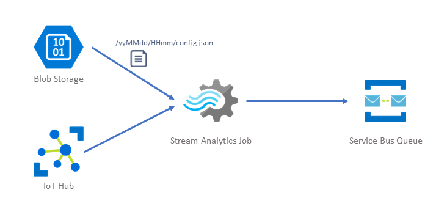
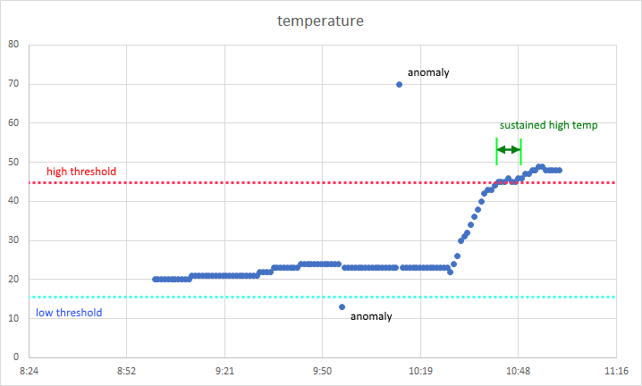

# IoT Environmental Monitoring - Stream Processing for Configurable Alert Thresholds

_Posted by: [Regan Murphy]((https://about.me/nzregs)) [(@nzregs)](https://twitter.com/nzregs), Software Engineer, Microsoft_
 

When monitoring sensor data like temperature, or humidity, you especially want to know when values fall outside of a speciific range.  E.g. where the environment you are monitoring has readings exceeding a threshold where devices can operate normally.

Take temperature, for example. Let's say we have an environment that we are monitoring where the equipment will start to malfunction at temperatures over 50 degrees celcius (122 Fahrenheit if you must).  In this case the monitoring system will need to generate alerts at a temperature lower than 50degC so that there is time to react to a problem and (hopefully) rectify the temperature before any damage to equipment occurs.

## Problem Statement

Build an alerting mechanism that can generate alerts in near-real-time across streaming IoT sensor data, with configurable thresholds.

## Our Environment

For the purposes of this write-up, let's assume we have already configured our IoT devices (e.g. Raspberry Pi 3 with sensors) and an [Azure IoT Hub](https://azure.microsoft.com/en-us/services/iot-hub/) for ingesting events. We will also assume that there is an alerting application responding to messages that we output to an [Azure Service Bus Queue](https://docs.microsoft.com/en-us/azure/service-bus-messaging/service-bus-queues-topics-subscriptions).  This write-up will examine the [Azure Stream Analytics](https://docs.microsoft.com/en-us/azure/stream-analytics/) jobs that join the streaming data to  reference data as shown in the following diagram:



### Thresholds

We will use the following thresholds and window for Low, High, and Critical temperature readings:

| Measure | Low (degC) | High (degC) | Critical (degC) | Window |
| ------- | ---------- | ----------- | --------------- | ------ |
| Temperature | 15 | 45 | 50 | 5 minutes |


### IoT Sensor Stream Data

For the purposes of this write-up, let's assume our stream of data arriving at an [Azure IoT Hub](https://azure.microsoft.com/en-us/services/iot-hub/) is in JSON format and looks like this:
```JSON
{ "DeviceName": "monitor01", "EventTime" : "2018-09-12T06:21:03.4710000Z", "temperature" : 43.0, "humidity" : 56}
```

## Alert when single temperaure value crosses a threshold

If you simply want to generate alert conditions every time a temperature has exceeded the threshold set, then it is a pretty simple Stream Analytics Query:

```sql
SELECT
    DeviceName,
    EventTime,
    'ALERT' as Status,
    1 as NumberReadings,
    Temperature as MinTemperature,
    Temperature as MaxTemperature,
    Temperature as AvgTemperature
INTO
    [HighTemperature]
FROM
    IoTMessages
WHERE
    Temperature > 45
```

This is OK when you have a reliable data source, but what if you get the occaisional anomaly in your data?

Take the following temperature over time chart.  There is an anomalous low reading (13 degC), an anomalous high reading (70 degC).  In this case these two outliers are obvioulsy anomalies and we shouldn't alert on these.  



The first time we want to raise an alert is when the first met or exceeded the threshold for a window of 5 minutes which occurred between 10:42 to 10:46.

## Alert on sustained high temperature

As it turns out, Stream Analytics makes it fairly easy to detect this and only generate events when the temperature meets or exceeds the threshold over a sustained period (window).  We can use [Stream Analytics windowing functions](https://docs.microsoft.com/en-us/azure/stream-analytics/stream-analytics-window-functions) for this.

Because we want to continuously alert when a temperature is over the threshold, and has been for the previous five minutes (our configured window), we will use a Sliding Window. *NOTE: If we used a tumbling window, we would likely be late, or miss, periods when a sustained temperature event occurs).*

The Stream Analytics query for the sliding window looks like this:
```sql
SELECT
    DeviceName,
    MAX(EventTime) as EventTime,
    'ALERTING' as Status,
    COUNT(*) as NumberReadings,
    MAX(Temperature) as MaxTemperature,
    MIN(Temperature) as MinTemperature,
    AVG(Temperature) as AvgTemperature
INTO
    [HighTemperature]
FROM
    IoTMessages TIMESTAMP BY EventTime
GROUP BY
    DeviceName,
    SlidingWindow(minute, 5)
HAVING
    MAX(Temperature) >= 45
```

OK, now we have a query continuously sending out messages to our Service Bus Queue alerting when our system is breaching a high temperature threshold.  

## Alert when temperature condition is resolved

How do we tell our application that this high temperature threshold condition has finished?  We could code our application to test for **absence** of events, after a detection period, but it would be better if we could send another message that says this right?

Again, Stream Analytics has a function that can help us here.  This is the [LAG function](https://msdn.microsoft.com/en-us/azure/stream-analytics/reference/lag-azure-stream-analytics).  With the LAG function we can measure for a condition over time (e.g. sustained high temperature) and detect when that condition resolves (e.g. temperature crosses back below threshold again)

Let's see what that looks like in Stream Analytics:

```sql
SELECT
    DeviceName,
    EventTime,
    'RESOLVED' as Status,
    1 as NumberReadings,
    Temperature as MaxTemperature,
    Temperature as MinTemperature,
    Temperature as AvgTemperature
INTO
    [HighTemperature]
FROM
    IoTMessages
WHERE
    Temperature < 45
    AND LAG(temperature) OVER (PARTITION BY DeviceName LIMIT DURATION(minute, 5)) >= 45)
```

After a period of time (5 minutes) where the temperature has been consistently over 45, this query will produce a row the first time that temperature crosses below 45 effectively sending our application a STOP message.

## Configurable Thresholds

In an environmental monitoring system you usually want to be able to configure the low, high, and critical thresholds.  It may be that you need to refine them after bedding in a new environment, or maybe you deployed some new equipment that has lower tolerances.

You have a couple of options:
1. Edit your Stream Analytics Query
2. Proide "runtime configuration data" to your Stream Analytics Query 

### Option 1 - Edit/replace Stream Analytics query

Changing static values in the query is pretty straight forward and could be achieved with atokenised template. Deploying the changes, however, will require you to stop your Stream Analytics query job, update the SQL, publish changes (e.g. using [DevOps CI/CD pipelines and an ARM template](https://docs.microsoft.com/en-us/azure/stream-analytics/stream-analytics-tools-for-visual-studio-cicd)), and then re-start the job.  This means there will be a time when your job is not running and therefore your environmental monitoring solution _will not be generating alerts_.

You could potentially mitigate this by creating the changes in a second stream analytics job and starting that before stopping the old one. 

### Option 2 - Provide runtime configuration

There is a mechanism in Stream Analytics that allows the incorporation of [slowing changing reference data](https://docs.microsoft.com/en-us/azure/stream-analytics/stream-analytics-use-reference-data) in your queries.  If we place files in an Azure Blob Storage container with tokenised date and time placeholders, the Stream Analytics job will be able to check for, and load, new reference data once every minute.

Let's consider a configuration file that looks like the following:

```JSON
[
    {
        "DeviceName": "monitor01",
        "LowTemperatureThreshold": 15.0,
        "HighTemperatureThreshold": 45.0,
        "CriticalTemperatureThreshold": 50.0,
        "TemperatureThresholdWindow": 5
    }
]
```

Every time our configuration application or website makes changes to this file, we could automatically dump a copy into the following blob container with todays date and time:

```
/configuration/yyyy-MM-dd/HH-mm/config.json
```

We could then add a [reference data input](https://docs.microsoft.com/en-us/azure/stream-analytics/stream-analytics-use-reference-data) to our Stream Analytics Job can configure the path pattern as:

```
/configuration/{date}/{time}/config.json
```

and select "YYYY-MM-DD" and "HH-mm" as the patterns for Date and Time. 

We would then join it to our original query - in this example the High Temperature Alert query - in Stream Analytics and modify the query as follows:

```sql
SELECT
    DeviceName,
    MAX(EventTime) as EventTime,
    'ALERTING' as Status,
    COUNT(*) as NumberReadings,
    MAX(Temperature) as MaxTemperature,
    MIN(Temperature) as MinTemperature,
    AVG(Temperature) as AvgTemperature
INTO
    [HighTemperature]
FROM
    IoTMessages TIMESTAMP BY EventTime
    INNER JOIN ConfigFile 
        ON IoTMessages.DeviceName = ConfigFile.DeviceName
GROUP BY
    DeviceName,
    SlidingWindow(minute, 5)
HAVING
    MAX(Temperature) >= ConfigFile.HighTemperatureThreshold
```

With this query, stream analytics will check for a new reference data file, in a location matching the current date and time, every minute. If it finds a new file it will load it into memory and the updated data will be available to our runnning query. 

### Changing the window time - not via runtime configuration

If you need to be able to configure the window time - you cannot do that as a runtime configuration. Windows need to be provided via an **immutable constant** when the Stream Analytics job starts.  If you need to have a configurable window then you will need to look at Option 1 above and re-publish your Stream Analytics jobs.

# Conclusion

There are a many ways that alerting on environmental conditions can be built into in an application.  As you've seen above, [Azure Stream Analytics](https://docs.microsoft.com/en-us/azure/stream-analytics/) is a great solution for this.  Additionally , Azure Stream Analytics is an excellent choice if you need near-real-time, configurable and continuous alerting using at-scale IoT data streams flowing through an [Azure IoT Hub](https://azure.microsoft.com/en-us/services/iot-hub/).

# Further Reading: Stream Analytics Query Patterns and more

The Docs @ Microsoft team has a great article showing a number of other Stream Analytics common query patterns.  There also examples of Window Functions and Geopatial functions.  Check them out here:
* [Stream Analytics - Common query patterns](https://docs.microsoft.com/en-us/azure/stream-analytics/stream-analytics-stream-analytics-query-patterns)
* [Stream Analytics - Window functions](https://docs.microsoft.com/en-us/azure/stream-analytics/stream-analytics-window-functions)
* [Stream Analytics - Geospatial functions](https://docs.microsoft.com/en-us/azure/stream-analytics/stream-analytics-geospatial-functions)
* [Stream Analytics - Using Reference Data for Lookups (including slowing changing reference data)](https://docs.microsoft.com/en-us/azure/stream-analytics/stream-analytics-use-reference-data)
